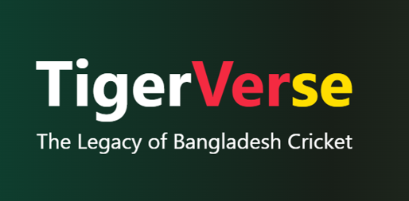

---

***Note:** This repository hosts the official fan project for Bangladesh's national cricket team, showcasing its enriched history, players, and legendary moments.*

## Introduction

**TigerVerse** is a dedicated cricket fan website built for supporters of Bangladesh’s national cricket team.  

It provides fans with a **comprehensive experience** of exploring Bangladesh cricket — from historic matches to modern-day squads, legendary players, and fan-driven features like custom squad creation.  

With its simple UI and powerful filtering options, TigerVerse ensures fans can relive their favorite moments and stay engaged with the team’s journey.  

---

## Features & Functionality

*   **History Archive**: Explore Bangladesh cricket’s journey through different eras.  
*   **Current Squad Viewer**: View current squads and filter by **year, match type, and venue**.  
*   **Match Details Explorer**: Access rich match data with filtering by **year, opponent, venue, and format**.  
*   **Player Profiles**: Detailed pages of players with stats, career highlights, and achievements.  
*   **Squad Builder**: Create your own custom squad of Bangladesh players.  
*   **Hall of Fame**: A tribute to the greatest Tigers who shaped Bangladesh cricket.  
*   **Best of BD**: Handpicked collection of the most iconic matches and unforgettable player moments.  

---

## Tech Stack

### Frontend
*   **Languages**: JavaScript, CSS  
*   **Package Manager**: npm  

### Backend
*   **Runtime**: Node.js  
*   **Entry Point**: `index.js`  

---

## How to Run

Follow these steps to set up and run **TigerVerse** locally.

### Prerequisites
1.  **Node.js & npm**: Install [Node.js](https://nodejs.org/) (includes npm).
2.  **Git**: Install [Git](https://git-scm.com/downloads).

### Setup

1. **Clone the Repository**:
    ```bash
    git clone https://github.com/yourusername/tigerverse.git
    cd tigerverse
    ```

2. **Install Dependencies**:
    ```bash
    npm install
    ```

3. **Run the Client**:
    ```bash
    npm run dev
    ```
    Client will be available at: `http://localhost:3000/` (default).

4. **Run the Server** (in a separate terminal):
    ```bash
    node index.js
    ```
    Server will run at: `http://localhost:8080/` (or your configured port).

---

## Screenshots

| Home Page | Home Page |
| :---------------------------: | :---------------------------: |
|  |  |
| Match Details | Player Profile |
|  |  |
| Squad Details | Player Profile |
|  |  |
---

## Project Structure
tigerverse/
├── client/        # Frontend files
├── server/        # Backend logic
├── assets/        # Images, screenshots, static resources
├── index.js       # Entry point for backend
└── README.md      # Project documentation


