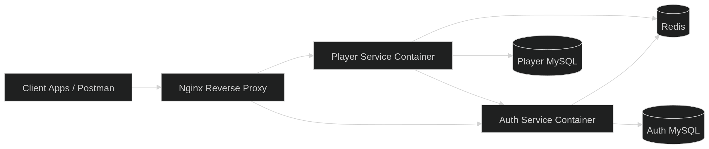
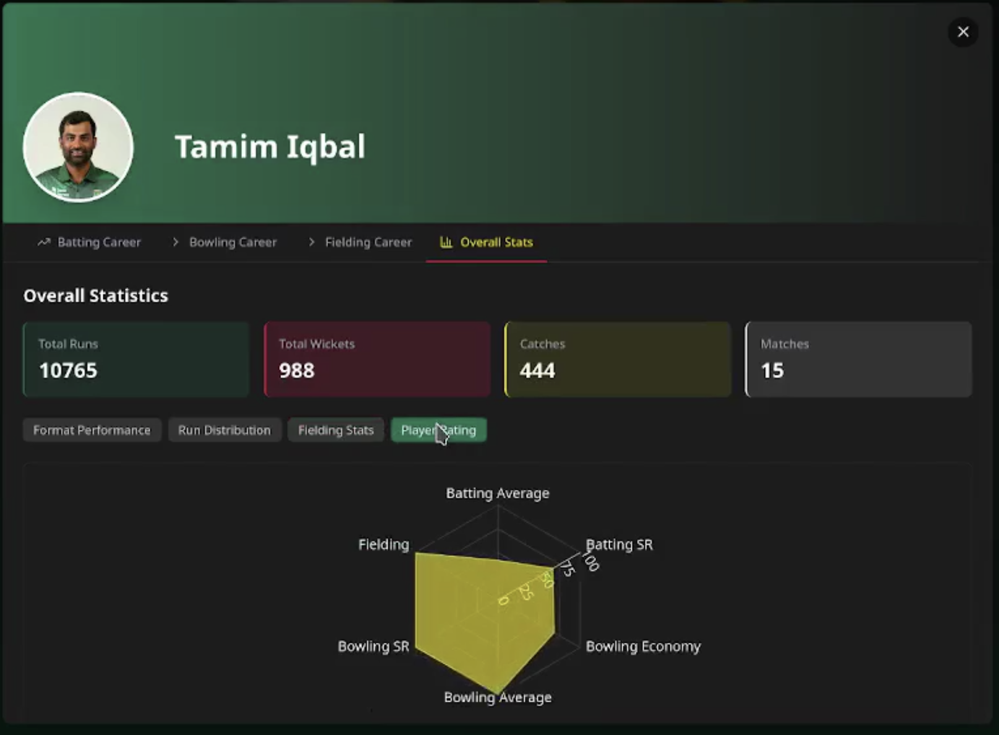

# TigerVerse

## Demo

<video width="100%" controls>
  <source src="./assets/demo.mp4" type="video/mp4">
  Your browser does not support the video tag.
</video>

Or [download the demo video](./assets/demo.mp4)

---

## Overview

TigerVerse is a **data-driven full-stack application** built to handle, process, and visualize large volumes of structured sports data.

The platform focuses on Bangladesh cricket and delivers a fast, intuitive experience for exploring:
- player statistics
- match history
- squad compositions
- performance insights

This project is designed not just as a UI application, but as a **backend-heavy system optimized for data storage, querying, and visualization**.

---

## Core Focus

TigerVerse is built around three key pillars:

### 1. Data Storage
- Structured cricket datasets (players, matches, squads, images)
- Relational modeling using MySQL
- Separation of concerns across services

### 2. Data Processing
- Complex queries via stored procedures
- Match filtering (year, opponent, venue, format)
- Squad generation and manipulation logic
- Aggregations for insights (H2H, performance stats)

### 3. Data Visualization
- Clean UI for exploring datasets
- Dynamic filtering for fast exploration
- Structured presentation of player and match data
- Optimized responses using caching (Redis)

---

## Key Highlights

- Microservice-inspired backend (Auth + Player services)
- Reverse proxy architecture using Nginx
- MySQL (separated per service)
- Redis caching for performance optimization
- Dockerized deployment for consistency
- Data-heavy backend with optimized querying
- Interactive frontend for sports data exploration

---

## Architecture



---

### Application Screens


| Match Details | Player Profile |
| :---------------------------: | :---------------------------: |
|  |  |

| Squad View | Player Profile |
| :---------------------------: | :---------------------------: |
|  |  |

| Home Page | Home Page |
| :---------------------------: | :---------------------------: |
|  |  |

---

## Backend Design

### Auth Service
Handles:
- Authentication
- Token/session management
- User validation

---

### Player Service
Core data engine of the system.

Handles:
- Player datasets
- Match datasets
- Squad building logic
- Filtering and querying
- Stored procedure execution

---

### Redis
- Caching layer for frequent queries
- Reduces database load
- Improves response time

---

### MySQL
- Primary data store
- Stores large structured sports datasets
- Uses stored procedures for complex logic

---

### Nginx
- Entry point to the system
- Routes traffic between services
- Enables scalable architecture

---

## Request Flow

Client → Nginx → Service → Redis / MySQL → Response

---

## Data & Visualization

TigerVerse emphasizes **efficient data handling and intuitive visualization**.


---

## Tech Stack

Frontend: JavaScript, CSS  
Backend: Node.js, Express  
Database: MySQL  
Cache: Redis  
Infra: Docker, Nginx  

---

## Run Project

### Docker (Recommended)

```bash
docker compose up --build -d
